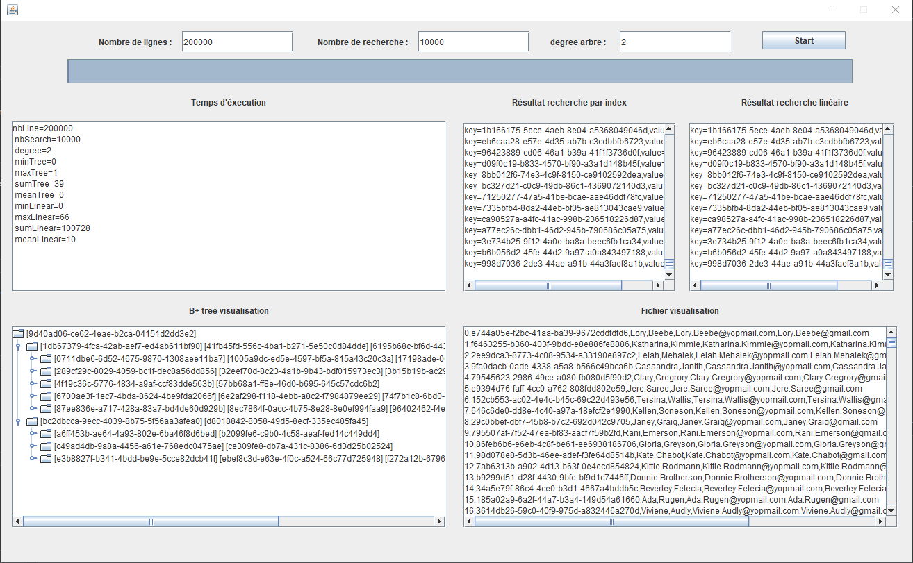

# Project-M1-BDD, Recherche SQL Server et indexation java

**Participants du projet :**

- Belkarfa Lina
- Bouche Steven
- Garnier Corentin
- Griseri Pierre
- Parent Margaux
- Prevot Armand

## Partie 1 : Evaluation d’un SGBD relationnel du marché

Rapport : 

## Partie 2 : Projetsur  les  thématiques  liées  à l’indexation et la recherche

Projet dans le dossier : java-project

Implémentation B+ tree avec noeud (contenant les keys) et feuilles (association des keys avec valeur). Chaque feuille ayant une référence sur la feuille suivante pour permettre une recherche séquentielle. 


Mis en place de statistiques sur le temps lié à la compléxité des recherches. Les statistiques ont étais fais sur une base de 5000 recherches pour chaque méthodes avec un degré de 2 pour le B+ tree. 

Statistiques sur :

- Recherche par index dans l'arbre
- Recherche séquentiel dans l'arbre (en mémoire via l'arbre)
- Recherche directement dans le fichier (accès au fichier)

Tous les temps sont en miliseconde, les indexes pour la recherche sont tirés de façon aléatoire. Le programme des stats est le main situé dans la classe StatIndex. 

Il est soit possible d'éxecuter :

- le main StatIndex afin de définir plusieurs éxecutions de recherche dans un programme en ligne de commande. 
- le main MainUIStat pour pouvoir avoir des statistiques sur le temps d'éxecution en fonction du nombre de ligne et d'un nombre de recherche définit par l'utilisateur sur un fichier de 200 000 lignes au maximum. 

Screenshot de l'interface du programme MainUIStat :



Nos résultats avec le programme en ligne de commande :

```json
[
   {
      "nbLine":10000,
      "nbSearch":5000,
      "degree":2,
      "minTree":0,
      "maxTree":1,
      "sumTree":12,
      "meanTree":0,
      "minLinear":0,
      "maxLinear":3,
      "sumLinear":637,
      "meanLinear":0,
      "minFile":0,
      "maxFile":83,
      "sumFile":9026,
      "meanFile":1
   },
   {
      "nbLine":30000,
      "nbSearch":5000,
      "degree":2,
      "minTree":0,
      "maxTree":1,
      "sumTree":6,
      "meanTree":0,
      "minLinear":0,
      "maxLinear":3,
      "sumLinear":2186,
      "meanLinear":0,
      "minFile":0,
      "maxFile":18,
      "sumFile":25883,
      "meanFile":5
   },
   {
      "nbLine":50000,
      "nbSearch":5000,
      "degree":2,
      "minTree":0,
      "maxTree":1,
      "sumTree":7,
      "meanTree":0,
      "minLinear":0,
      "maxLinear":7,
      "sumLinear":6667,
      "meanLinear":1,
      "minFile":0,
      "maxFile":66,
      "sumFile":44220,
      "meanFile":8
   },
   {
      "nbLine":70000,
      "nbSearch":5000,
      "degree":2,
      "minTree":0,
      "maxTree":1,
      "sumTree":6,
      "meanTree":0,
      "minLinear":0,
      "maxLinear":9,
      "sumLinear":10263,
      "meanLinear":2,
      "minFile":0,
      "maxFile":41,
      "sumFile":61146,
      "meanFile":12
   },
   {
      "nbLine":90000,
      "nbSearch":5000,
      "degree":2,
      "minTree":0,
      "maxTree":1,
      "sumTree":7,
      "meanTree":0,
      "minLinear":0,
      "maxLinear":9,
      "sumLinear":14541,
      "meanLinear":2,
      "minFile":0,
      "maxFile":101,
      "sumFile":80477,
      "meanFile":16
   },
   {
      "nbLine":110000,
      "nbSearch":5000,
      "degree":2,
      "minTree":0,
      "maxTree":1,
      "sumTree":8,
      "meanTree":0,
      "minLinear":0,
      "maxLinear":38,
      "sumLinear":16821,
      "meanLinear":3,
      "minFile":0,
      "maxFile":50,
      "sumFile":92595,
      "meanFile":18
   },
   {
      "nbLine":130000,
      "nbSearch":5000,
      "degree":2,
      "minTree":0,
      "maxTree":1,
      "sumTree":7,
      "meanTree":0,
      "minLinear":0,
      "maxLinear":40,
      "sumLinear":21420,
      "meanLinear":4,
      "minFile":0,
      "maxFile":65,
      "sumFile":111840,
      "meanFile":22
   },
   {
      "nbLine":150000,
      "nbSearch":5000,
      "degree":2,
      "minTree":0,
      "maxTree":1,
      "sumTree":6,
      "meanTree":0,
      "minLinear":0,
      "maxLinear":10,
      "sumLinear":15803,
      "meanLinear":3,
      "minFile":0,
      "maxFile":63,
      "sumFile":126300,
      "meanFile":25
   },
   {
      "nbLine":170000,
      "nbSearch":5000,
      "degree":2,
      "minTree":0,
      "maxTree":1,
      "sumTree":4,
      "meanTree":0,
      "minLinear":0,
      "maxLinear":12,
      "sumLinear":23756,
      "meanLinear":4,
      "minFile":0,
      "maxFile":110,
      "sumFile":142510,
      "meanFile":28
   },
   {
      "nbLine":190000,
      "nbSearch":5000,
      "degree":2,
      "minTree":0,
      "maxTree":1,
      "sumTree":9,
      "meanTree":0,
      "minLinear":0,
      "maxLinear":15,
      "sumLinear":30829,
      "meanLinear":6,
      "minFile":0,
      "maxFile":100,
      "sumFile":161568,
      "meanFile":32
   }
]
```
